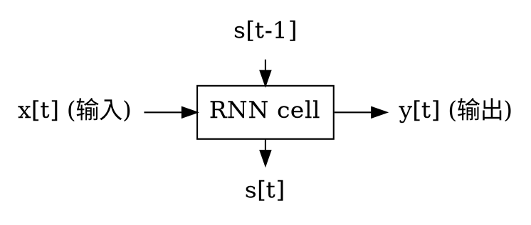
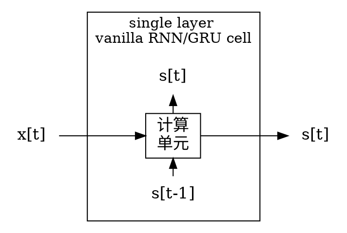
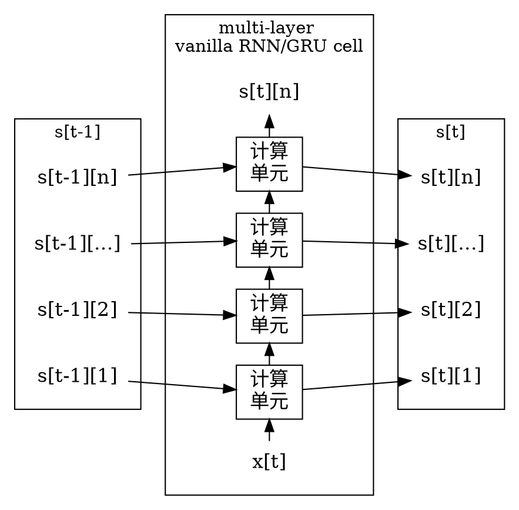
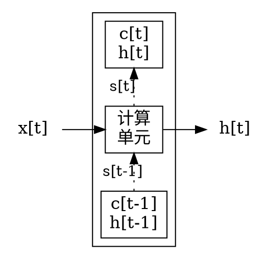

<!-- @import "../../引用/my-style.less" -->

# 循环神经网络 Recurrent neural network

神经网络是一种节点定向连接成环的人工神经网络，其内部状态可以展示动态时序行为。不同于前馈神经网络的是，RNN可以利用它内部的记忆来处理任意时序的输入序列，因此可以更容易地处理序列问题，如不分段的手写识别、语音识别等。

- `state`：神经元内部的状态

- `hidden state`：`LSTM`神经元中特有的隐藏状态

RNN 的一般工作过程如下：

- `s[t-1]` 与 `s[t]` 对应网络内部的 `state` 计算前后的两个不同状态。

## Vanilla RNN

单层的 Vanilla RNN/GRU Cell 只有一个循环部件 `state`，其工作过程如下：

- `s[t]` 是 cell 的内部部件 `state`，`s_t = y_t = h_t`。

构筑一个多层的 Vanilla RNN/GRU Cell，可以将多层 `cell` 抽象成一个整体，当成一层大的 `cell`，原先各层之间的关系都当成这个大的 `cell` 的内部计算过程或数据流动过程。因此对外而言，多层的 RNN 和单层的 RNN 的接口就是一模一样的。多层 RNN 只是一个内部计算更复杂的单层 RNN。

        {rank=same; compute_cell1 a1 b1}
        {rank=same; compute_cell2 a2 b2}
        {rank=same; compute_cell3 a3 b3}
        {rank=same; compute_celln an bn}

## Long short-term memory (LSTM)

Long short-term memory 单元是 RNN 单元的一种，由这种单元构成的网络叫做 **LSTM network**。

`LSTM` 单元的循环部件有两部分，输出层只利用 hidden state 的信息，而不直接利用 cell:

- 内部 cell 的值
- 根据 cell 和 `output gate` 计算出的 `hidden state`。

单层 `LSTM` 单元的工作过程：

其中真正用于循环的状态 $s_t$ 其实是 $(c_t, h_t)$ 组成的 `tuple`，就是 TensorFlow 里的 `LSTMStateTuple`。

`LSTM` 单元的输出 $y_t$ 仅仅是 $h_t$。网络后面再接一个全连接层然后用 softmax 做分类，这个全连接层的输入仅仅是 $h_t$，而没有 $c_t$。这与 vanilla RNN 的输出完全不同。