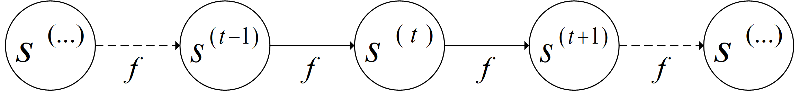
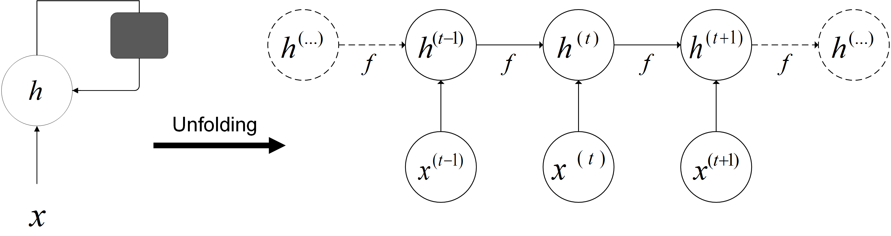
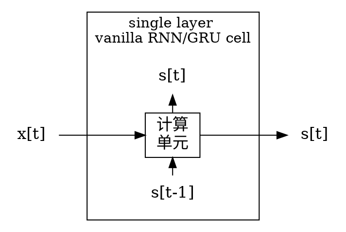
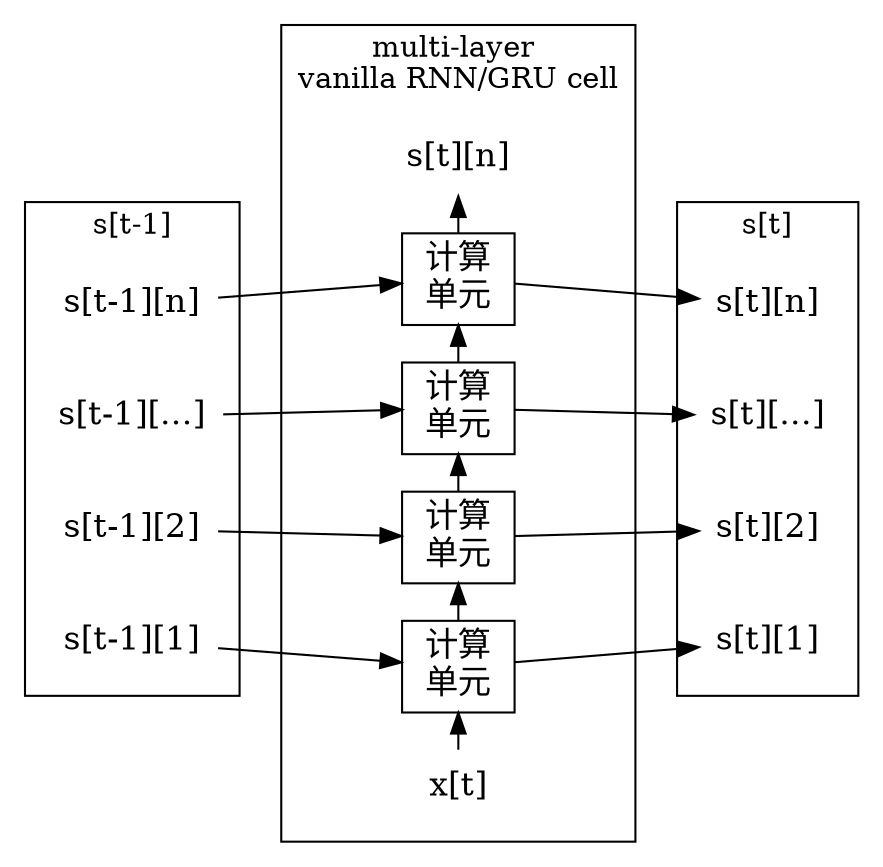
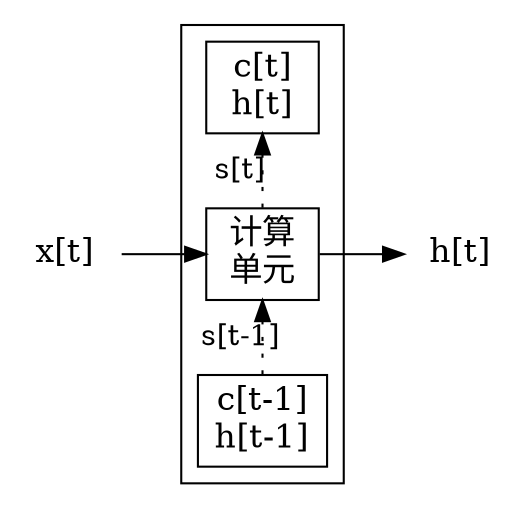

<!-- @import "../引用/my-style.less" -->

# 循环神经网络 Recurrent neural network

神经网络是一种节点定向连接成环的人工神经网络，其内部状态可以展示动态时序行为。不同于前馈神经网络的是，RNN可以利用它内部的记忆来处理任意时序的输入序列，因此可以更容易地处理序列问题，如不分段的手写识别、语音识别等。

## $1$ 展开计算图 Unfolding calculation chart

考虑**动态系统**的经典形式，如下式 $(1.1)$，其中 $s^t$ 是系统的状态。$s$ 在时刻 $t$ 的定义需要参考时刻 $t-1$ 时同样的定义，因此式 $(1.1)$ 是**循环的**。对于有限时间步 $\mathcal{T}$，$\mathcal{T}-1$ 次应用这个定义就可以展开这个计算图。

$$s^t = f(t^{t-1}; \theta) \tag{1.1}$$

例如 $\mathcal{T}=3$，按照式 $(1.1)$ 展开后如下式 $(1.2)$。因为重复使用定义来展开表达式，最终可以得到不涉及循环的表达。同时，$\{s^1, \theta\}$ 就定义了整个序列。

$$
\begin{aligned}
    s^3 &= f(s^2; \theta) \\
        &= f(f(s^1; \theta); \theta)
\end{aligned}\tag{1.2}
$$

一般情况下，使用的是由**外部信号** $x^t$ 驱动的动态系统，如下式 $(1.3)$。在该系统中，当前状态包含了之前所有序列的信息。

$$s^t = f(s^{t-1};x^t, \theta)$$

同样考虑 $\mathcal{T}=3$ 的情况，可以得出

$$
\begin{aligned}
    s^3 &= f(s^2, x^2; \theta) \\
        &= f(f(s^1, x^1; \theta), x^2; \theta)
\end{aligned}\tag{1.2}
$$

有很多不同的方法可以构建循环神经网络。事实上几乎所有的函数都可以被认为是前馈神经网络，本质上任何涉及循环的函数都可以视为循环神经网络。$s$ 是网络中的中的隐藏单元，因此一般用 $h$ 来代替。因此，循环神经网络的一般形式是：

$$h^t=f(h^{t-1}, x^t; \theta)$$

$h^t$ 是过去序列与任务相关方面的**有损摘要**。**摘要过程**是有损的，其映射任意长度的序列到一固定长度的向量 $h^t$。根据不同的训练准则，摘要过程可能选择性地精确保留过去序列的某些方面。

- 无论序列的长度，模型始终具有相同的输入大小，它指的是从一种状态到另一种状态的转移。
- 可以在所有的时间步使用相同参数的相同转移函数 $f$。

## $2$ 循环神经网络

- 每个时间步都有输出，且隐藏单元之间有循环连接的循环网络。
- 每个时间步都有一个输出，只有**当前时刻的输出**到**下个时刻的隐藏单元**之间有循环连接的循环网络。
- 隐藏单元之间存在循环连接，但读取整个序列后产生单个输出的循环网络。

任何图灵可计算的函数都可以通过一个有限维的循环网络来计算。

$$\begin{cases}
    a^t       &= b + Wh^{t-1} +U x^t \\
    h^t       &= \tanh(a^t) \\
    o^t       &= c + Vh^t \\
    \hat{y}^t &= softmax(o^t)
\end{cases}\tag{2.1}
$$

式 $(2.1)$ 中 $a, b$ 是偏差（`bias`），$W, U, V$ 是权重矩阵。

**通过时间反向传播**（`back-propagation through time`，`BPTT`）。

## others

- `state`：神经元内部的状态

- `hidden state`：`LSTM`神经元中特有的隐藏状态

- `s[t-1]` 与 `s[t]` 对应网络内部的 `state` 计算前后的两个不同状态。

## Vanilla RNN

单层的 Vanilla RNN/GRU Cell 只有一个循环部件 `state`，其工作过程如下：

- `s[t]` 是 cell 的内部部件 `state`，`s_t = y_t = h_t`。

构筑一个多层的 Vanilla RNN/GRU Cell，可以将多层 `cell` 抽象成一个整体，当成一层大的 `cell`，原先各层之间的关系都当成这个大的 `cell` 的内部计算过程或数据流动过程。因此对外而言，多层的 RNN 和单层的 RNN 的接口就是一模一样的。多层 RNN 只是一个内部计算更复杂的单层 RNN。

        {rank=same; compute_cell1 a1 b1}
        {rank=same; compute_cell2 a2 b2}
        {rank=same; compute_cell3 a3 b3}
        {rank=same; compute_celln an bn}

## Long short-term memory (LSTM)

Long short-term memory 单元是 RNN 单元的一种，由这种单元构成的网络叫做 **LSTM network**。

`LSTM` 单元的循环部件有两部分，输出层只利用 hidden state 的信息，而不直接利用 cell:

- 内部 cell 的值
- 根据 cell 和 `output gate` 计算出的 `hidden state`。

单层 `LSTM` 单元的工作过程：

其中真正用于循环的状态 $s_t$ 其实是 $(c_t, h_t)$ 组成的 `tuple`，就是 TensorFlow 里的 `LSTMStateTuple`。

`LSTM` 单元的输出 $y_t$ 仅仅是 $h_t$。网络后面再接一个全连接层然后用 softmax 做分类，这个全连接层的输入仅仅是 $h_t$，而没有 $c_t$。这与 vanilla RNN 的输出完全不同。
