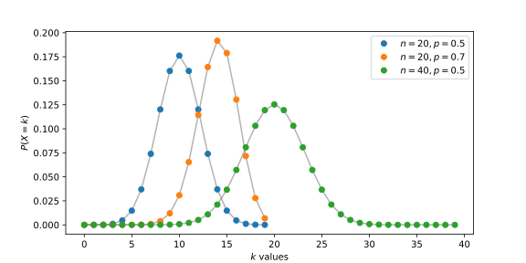
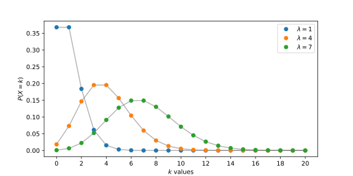
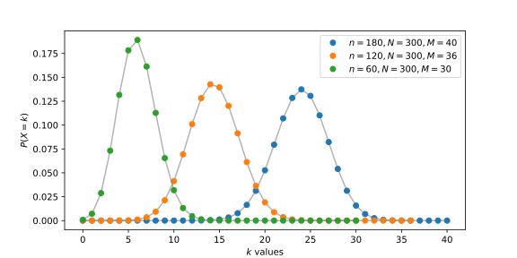
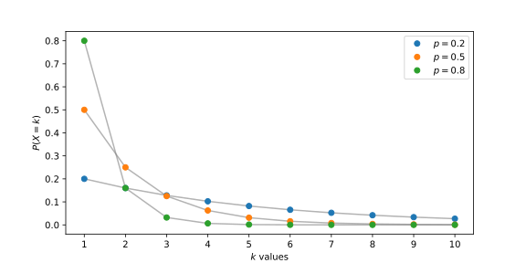
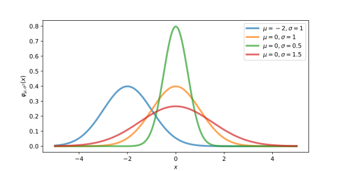
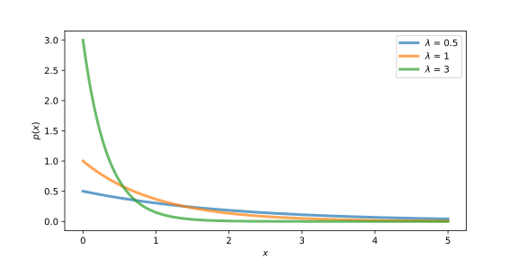
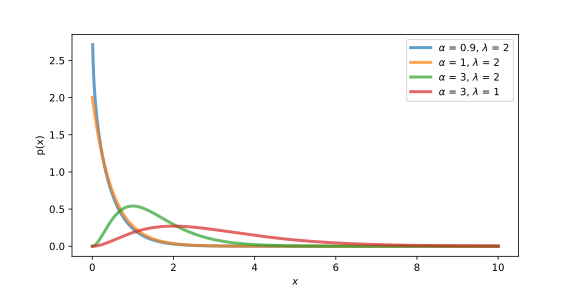
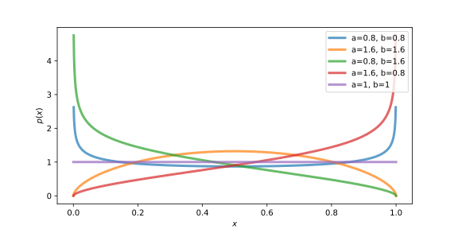

<!-- @import "../../引用/my-style.less" -->

# 随机变量与分布 Random variable and distribution

## 一、随机变量 Random variable

用来表示随机事件结果的变量称为**随机变量**。随机事件的本质是样本点的集合，因此定义一个随机变量就是定义一个映射过程，将样本点集（样本空间的子集）映射到实数集。

*每个随机变量都有一个分布*，有没有分布是区分一般变量与随机变量的主要标志。

>**定义：随机变量 Random variable**
定义在样本空间 $\Omega$ 上的实值函数 $X = X(\omega)$ 称为**随机变量**。常用大写字母 $X, Y, Z$ 来表示，其取值用 $x, y, z$ 等小写字母来表示。

假如一个随机变量仅可能取有限个值或可列个值，则称其为**离散随机变量**。假如一个随机变量的可能取值充满数轴上的一个区间 $(a, b)$，则称其为**连续随机变量**。其中 $a$ 的取值可以是 $-\infty$，$b$ 的取值可以是 $+\infty$。

### 1.1 随机变量的分布 Distribution of random variable

由于随机变量 $X$ 是样本点 $\omega$ 的实值函数，设有实数的集合 $B$，即 $B \subset \mathbf{R}$，则 $\{X \in B\}$ 表示如下的随机事件：
$$\{\omega：X(\omega) \in B\} \subset \Omega$$

同时，也可以用等号、不等号将随机变量 $X$ 与实数连接起来，表示某一特定的随机事件。

> **定义：分布函数 Cumulative distribution function**
设 $X$ 是一个随机变量，对任意实数 $x$，称
$$F(x)=P(X \leq x)$$
>
> 为随机变量 $X$的**分布函数**，且称 $X$ 服从 $F(x)$，记为 $X \sim F(x)$

任一随机变量 $X$（离散或连续）都有一个分布函数。任一分布函数都有如下的三条性质，它们是判别一个函数是否能成为分布函数的充要条件。

- **单调性**：$F(x)$ 是定义在整个实数轴 $(-\infty ,+\infty)$ 上的单调非减函数。

- **有界性**：对任意的 $x$，有 $0 \leq F(x) \leq 1$，且
    $$F(-\infty) = \lim_{x \rightarrow -\infty}F(x) = 0$$

    $$F(\infty) = \lim_{x \rightarrow \infty}F(x) = 1$$

- **右连续性**：$F(x)$ 是 $x$ 的右连续函数，即：

$$\lim_{x \rightarrow x_0^+}F(x)=F(x_0)$$

证明：略。

#### 1.1.1 概率分布列 List of probability distribution

对于离散随机变量而言，常用概率分布列来表示其分布。

> **定义：概率分布列与概率质量函数 List of probability distribution and probability mass function**
设 $X$ 是一个离散随机变量，如果 $X$ 的取值是 $\{x_1, x_2, \dots, x_n, \dots \}$，则称 $X$ 取 $x_n$ 时的概率 $p_n$ 为 $X$ 的**概率分布列**，简称**分布列**，记为 $X \sim \{p_n\}$。
>
> $$
\begin{matrix}
x_1    & x_2    & \dots & x_n    & \dots\\
p(x_1) & p(x_2) & \dots & p(x_n) & \dots
\end{matrix}$$
>
> 用于定义概率分布列的函数 $P(X=x_n)$ 也通常称为**概率质量函数** `Probability mass function`。
> $$p_n = p(x_n) = P(X=x_n)$$

概率分布列有如下两条基本性质，它也是判别一个数列是否是概率分布列的充要条件。

- **非负性**：$p(x_n) \geq 0, n=\{1,2,\dots\}$
- **正则性**：$\sum_{n=1}^{\infty}p(x_n)=1$

特别地，常量 $c$ 可以看作是仅取一个值的随机变量 $X$，即 $P(X=c)=1$。这个分布常称为**单点分布**或**退化分布**，它的分布函数是：
$$F(x)= \begin{cases}
\ 0, \ x < c \\
\ 1, \ x \geq c
\end{cases}$$

#### 1.1.2 概率密度函数 Probability density function

> **定义：概率密度函数 Probability density function**
设随机变量 $X$ 的分布函数为 $F(x)$，如果存在实数轴上的一个非负可积函数 $p(x)$，使得对任意实数 $x$ 有：
$$F(x)= \int_{-\infty}^xp(t)\mathrm{d}t$$
>
> 则称 $p(x)$ 为 $X$ 的**概率密度函数**，简称**密度函数**，或**密度**。

概率密度函数有如下两条基本性质，它也是判别一个函数是否为概率密度函数的充分条件。

- **非负性**：$p(x) \geq 0$
- **正则性**：$\int_{-\infty}^{\infty}p(x)\mathrm{d}x=1$

**注意**：连续随机变量 $X$ 在 $(-\infty, \infty)$ 上任一点 $a$ 的概率恒为 $0$，这是因为：
$$P(X=a)=\int_a^ap(x)\mathrm{d}x=0$$

这表明：不可能事件的概率为 $0$，但概率为 $0$ 的事件不一定是不可能事件；必然事件的概率为 $1$，但概率为 $1$ 的事件不一定是必然事件。

### 1.2 随机变量的数学期望与方差 Mathematical expectation and variance of random variable

**数学期望**（Mathematical expectation）反映随机变量的平均取值，简称**期望**（Expectation）或**均值**（Mean），可由随机变量的分布得出。随机变量的数学期望记为 $E(X)$，或简记为 $\mu$。

> **定义：数学期望 Mathematical expectation**
设离散随机变量 $X$ 的分布列为 $p(x_i)=P(X=x_i), \quad i \in \{1, 2, \dots\}$。如果 $\sum_{i=1}^\infty|x_i|p(x_i)<\infty$，则称 $(1)$ 式为 $X$ 的数学期望，也称该分布的数学期望。若级数 $\sum_{i=1}^\infty|x_i|p(x_i)$ 不收敛，则称 $X$ 的数学期望不存在。要求该级数绝对收敛的目的是使数学期望唯一。
>
> 设连续随机变量 $X$ 的密度函数为 $p(x)$。如果 $\int_{-\infty}^{\infty}|x|p(x)\mathrm{d}x < \infty$，则称 $(2)$ 式为 $X$ 的数学期望，也称该分布的数学期望。
> $$E(X)=\sum_{i=1}^\infty x_ip(x_i)\tag{1}$$
>
> $$E(X)=\int_{-\infty}^{\infty}xp(x)\mathrm{d}x\tag{2}$$

数学期望的物理解释是重心。数学期望有如下定理与性质：

> **定理：随机变量函数的期望 Expectation of function of random variable**
若随机变量 $X$ 的公布用分布列 $p(x_i)$ 或密度函数 $P(x)$ 表示，且其数学期望存在，则 $X$ 的某一函数 $\mathrm{g}(X)$ 的数学期望为：
> $$E[\mathrm{g}(X)]=\begin{cases}
> \sum_i\mathrm{g}(x_i)p(x_i) \quad                         & \text{discrete variable}\\
> \int_{-\infty}^{\infty}\mathrm{g}(x)p(x)\mathrm{d}x \quad & \text{continuous variable}
\end{cases}$$

数学期望的常用性质：

- 若 $c$ 是常数，则 $E(c) = c$。
- 对任意常数 $a$，有 $E(aX) = aE(X)$。
- 对任意的两个函数 $\mathrm{g}_1(x)$ 和 $\mathrm{g}_2(x)$，有
    $$E[\mathrm{g}_1(x) \pm \mathrm{g}_2(x)] = E[\mathrm{g}_1(x)] \pm E[\mathrm{g}_2(x)]$$

**方差**（Variance）用来度量随机变量与其数学期望之间的偏离程度，因此也可以度量随机变量的离散程度。随机变量的方差记为 $Var(X)$，或简记为 $\sigma^2$。

> **定义：方差 Variance**
若随机变量 $X$ 的数学期望 $E(X)$ 存在，则称其偏差平方 $(X - E(X))^2$ 的数学期望为随机变量 $X$ 及其分布的方差 $\sigma^2$。记为
$$\begin{aligned}
Var(X)
&= E(X - E(X))^2\\
&=\begin{cases}
\ \sum_i(x_i - E(X))^2p(x_i) \quad                     & discrete\ variable\\
\ \int_{-\infty}^\infty(x-E(X))^2p(x)\mathrm{d}x \quad & continuous\ variable
\end{cases}
\end{aligned}$$
>
> 称方差的平方根 $\sqrt{Var(X)}$ 为该随机变量 $X$ 及其分布的标准差，记为 $\sigma(x)$ 或 $\sigma_x$。

随机变量的方差若存在，则其数学期望一定存在。反之，则不然。标准差与其随机变量、数学期望有相同的量纲，因此它们之间的运算 $E(X) \pm k\sigma(x)$ 是有意义的。

方差有如下的性质（假定其存在）：

- $Var(X) = E(X^2) - [E(X)]^2$
- 若 $a$ 是常数，则 $Var(c)=0$。
- 若 $a,\ b$ 是常数，则 $Var(aX+b) = a^2Var(X)$ 。

> **定理：切夫雪比不等式 Chebyshev's inequality**
设随机变量的数学期望 $\mu$ 和方差 $\sigma^2$ 均存在，则对任意常数 $\varepsilon > 0$，称 $\{|X-\mu| \geq \varepsilon\}$ 为**大偏差**，其概率为**大偏差发生概率**。大偏差发生概率的上界有：
$$P(|X-\mu| \geq \varepsilon) \leq \frac {\sigma^2} {\varepsilon^2}\\
P(|X-\mu| < \varepsilon) \geq 1 - \frac {\sigma^2} {\varepsilon^2}$$

由上述定理可知，大偏差发生概率的上界与方差成正比。

> **定理**
若随机变量 $X$ 的方差存在，则 $Var(x)=0$ 的充要条件是 $X$ 几乎处处为某个常数 $a$，即 $P(X=a)=1$。

若随机变量的方差的值为 $0$，则其取值必然集中在一点。

## 二、常用离散分布 Common discrete distribution

离散分布是指离散随机变量的分布，常用分布列来表示。

### 2.1 二项分布 Binomial distribution

在关于事件 $A$（成功概率为 $p$）的 $n$ 重伯努利实验中，实验的基本结果或**样本点**可以记作：

$$\omega=(\omega_1,\omega_2,\cdots,\omega_n)$$

其中，$\omega_i$ 为单次实验的结果，其值为 $A$ 或者 $\bar{A}$。这样的 $\omega$ 共有 $2^n$ 个，它们共同组成了样本空间 $\Omega$。

> **定义：二项分布 Binomial distribution**
记 $n$ 重伯努利实验中事件 $A$ **发生的次数**为随机变量 $X$，其可能的取值为 $\{0,1,\cdots,n\}$。$X$ 服从的分布为**二项分布**，记为 $X \sim b(n,p)$。$X$ 服从的分布为：
$$P(X=k)=\binom n k p^k (1-p)^{n-k}, \ k \in \{0,1,\cdots,n\}$$

**证明**：随机变量 $X$ 的分布列即列举事件 $\{X=k | \ k=0, 1, \dots,n\}$ 的概率。假设有某个样本点：
$$\omega=(\omega_1,\omega_2,\cdots,\omega_n) \in \{X=k\}$$

则表示 $\omega$ 中有 $k$ 个 $A$，$n-k$ 个 $\bar{A}$。由于实验是相互独立的，因此：

$$P(\omega)=p^k(1-p)^{n-k}$$

而事件 $\{X=k\}$ 中这样的样本点一共有 $\binom n k$ 个，故事件 $A$ 的分布列为：

$$P(X=k)=\binom n k p^k (1-p)^{n-k}, \ k \in \{0,1,\cdots,n\}$$

#### 2.2 二点分布 Bernoulli distribution

> **定义：二点分布 Bernoulli distribution**
当 $n=1$ 时的二项分布 $X \sim b(1,p)$ 称为**二点分布**、**0-1分布**或**伯努利分布**。其分布列为$P(X=k)=p^k(1-p)^{1-k}, \ k \in \{0,1\}$，或记为：
$$\begin{pmatrix}
0   &   1 \\
1-p &   p
\end{pmatrix}
$$

### 2.3 泊松分布 Poisson distribution

泊松分布常与单位时间、面积上的**计数过程**相联系。泊松分布的概率分布列为：

$$P(X=k)=\frac {\lambda^k} {k!}\mathrm{e}^{-\lambda}, \ k \in \{0,1,2,\cdots\}$$

其中参数 $\lambda > 0$，记为 $X \sim P(\lambda)$。**泊松分布的数学期望和方差均为 $\lambda$**。

#### 2.4 二项分布的泊松近似

泊松分布适合于描述单位时间（或空间等）内随机事件发生的次数。**泊松分布的本质是二项分布的极限**。

>**定理：泊松定理 Poisson limit theorem**：在 $n$ 重伯努利实验中，记事件 $A$ 在一次实验中发生的概率为 $p_n$（与实验次数 $n$ 有关）。如果当 $n \rightarrow \infty$ 时，有 $np_n \rightarrow \lambda$，则该实验成功次数为 $k$ 时的概率有如下近似：
>
>$$
P_n(X=k)
=\lim_{n \rightarrow \infty} \binom n k p_n^k (1-p_n)^{n-k}
= \frac {\lambda^k} {k!} e^{-\lambda}
$$

假设在时间 $T$ 内，随机事件 $A$ 的发生次数为 $X$。将该时间 $T$ 非常细地分割为 $n$ 小段 $(t_1,t_2,\dots,t_n)$，使得在时间段 $t_i$ 上事件 $A$ 是否发生服从于二点分布。且有：

- 时间 $t_i$ 内事件 $A$ 发生的概率与 $t_i$ 的长短成正比
- 各时间段 $(t_1,t_2,\dots,t_n)$ 是否发生事件 $A$ 是相互独立的

此时，随机事件 $A$ 在时间段 $T$ 内发生的次数服从二项分布 $b(n,p)$，也即

$$P_n(X=k)=\binom n k p_n^k (1-p_n)^{n-k}$$

假若将时间 $T$ 分割地无限细（$n \rightarrow \infty$）时有 $np_n \rightarrow \lambda$，则根据泊松定理可得：在时间 $T$ 内事件 $A$ 发生的次数服从泊松分布，$X \sim P(\lambda)$。

### 2.5 超几何分布 Hypergeometric distribution

设有 $N$ 件产品，其中有 $M$ 件不合格品。若从中**不放回**地**随机**取出 $n$ 件，则其中含有的不合格品的件数 $X$ 服从超几何分布。概率分布列为：

$$P(X=k)= \frac {\binom M k \binom {N-M} {n-k}} {\binom N n},
k \in [0, \min(M,n)]$$

其中，$M \in [0, N]$，$n \in [0, N]$，$n$、$N$、$M$ 均为正整数。若 $X$ 服从超几何分布，记为 $X \sim h(n, N, M)$。

若 $X \sim h(n, N, M)$，则有：

$$E(X)=n \frac M N$$

$$Var(X) = \frac {nM(N-M)(N-n)} {N^2(N-1)}$$

### 2.6 几何分布 Geometric distribution

> **定义：几何分布 Geometric distribution**
在关于事件 $A$ 的伯努利实验序列中，记每次试验中事件 $A$ 的发生概率为 $p$。如果 $X$ 为事件 $A$ 首次发生时实验已累计的次数，则 $X$ 的可能取值为 $\{1,2,\cdots\}$，称 $X$ 服从几何分布，记为 $X \sim Ge(p)$。其分布列为：
$$P(X=k)=(1-p)^{k-1}p,\ k \in \{1,2,\cdots\}$$

期望为 $E(x) = \frac 1 p$，方差为 $Var(x) = \frac {1-p} {p^2}$。

证明略。

> **定理：几何分布的无记忆性 Memoryless of Geometric distribution**
设 $X \sim Ge(p)$，则对任意正整数 $m$ 与 $n$ 有：
$$P(X > m + n| X > m) = P(X > n)$$

在一列伯努利试验序列中，$\{X>m\}$ 表示前 $m$ 次试验中 $A$ 没有发生。$\{X>m+n\}$ 表示在接下来的 $n$ 次试验中 $A$ 仍然没有发生。这个定理表明：在前 $m$ 次试验中 $A$ 没有发生的条件下，接下来的 $n$ 次试验中 $A$ 仍然没有发生的概率只与 $n$ 有关，而与之前的 $m$ 次试验无关。这种忘记前面试验结果的性质就是无记忆性。

证明略。

### 2.7 负二项分布 Negative binomial distribution

从几何分布可以延伸出**负二项分布**，亦称**巴斯卡分布**（Pascal）。

> **定义：负二项分布 Negative binomial distribution**
在关于事件 $A$ 的伯努利实验序列中，记每次试验中事件 $A$ 的发生概率为 $p$。如果 $X$ 为事件 $A$ 第 $r$ 次发生时实验已累计的次数，则 $X$ 的可能取值为 $\{r,\ r+1,\cdots\}$，称 $X$ 服从负二项分布或巴斯卡分布，记为 $X \sim Nb(r,p)$。其分布列为：
$$P(X=k)=\binom {k-1} {r-1}p^r(1-p)^{k-r},
\ k \in \{r,\ r+1,\ \dots\}$$

期望为 $E(x) = \frac r p$，方差为 $Var(x) = r \frac {1-p} {p^2}$。

证明略。

## 三、常用连续分布 Common continuous distribution

当一个随机变量在其区间内能够取任何数值时，称其为**连续随机变量**。连续随机变量的取值充满其区间 $(a, b)$，在区间中有无穷不可列个实数。因此描述连续随机变量的概率分布不能再使用分布列形式来表示，而是使用概率密度函数。

### 3.1 正态分布 Normal distribution

正态分布，又称高斯分布（Gaussian Distribution）。根据中心极限定理可得：一个随机变量如果是大量微小的、独立的随机因素的叠加结果，那么这个变量一般都可以认为服从正态分布。

> **定义：正态分布 Normal distribution**
若随机变量X的密度函数为：
$$
p(x)=\frac {1} {\sqrt{2\pi}\sigma} {\mathrm{e}}^
{-\frac {(x-\mu)^2} {2\sigma^2}}
$$
>
> 则称 $X$ 服从正态分布，称 $X$ 为正态变量，记为：
$$X \sim N(\mu,\sigma^2)$$

- $\mu$ 为正态分布的**位置参数**。
- $\sigma$ 为正态分布的**尺度参数**。
- 正态分布函数是**严格单调增函数**，且**处处可导**。

#### 标准正态分布 Standard Normal Distribution

称 $\mu=0,\sigma=1$ 时的正态分布 $U \sim N(0,1)$ 为标准正态分布，密度函数为 $\phi(u)$，分布函数为 $\Phi(u)$。

标准正态分布的分布函数不含任何未知参数，故 $\Phi(u)=P(U \leq u)$ 均为已知值。

#### 正态分布的标准化

正态分布有一个家族，其成员概括为：

$$
\{ N(\mu, \sigma^2): \ -\infty < \mu <\infty, \ \sigma > 0 \}
$$

一般正态分布都可以通过一个线性变换（标准化）转化成标准正态分布。设随机变量 $X \sim N(\mu,\sigma^2)$，则 $
U = \frac {X-\mu} {\sigma} \sim N(0,1)$。

#### 正态分布的3σ原则

设随机变量 $X \sim N(\mu,\sigma^2)$，则：

$$
\begin{aligned}
P(|X-\mu| < k\sigma)
    &= \Phi(k) - \Phi(-k)\\
    &= 2\Phi(k) - 1\\
    &=\begin{cases}
        0.6826, \ k=1 \\
        0.9545, \ k=2 \\
        0.9973, \ k=3 \\
    \end{cases}
\end{aligned}
$$

尽管正态分布的取值范围是 $(-\infty,\infty)$，但它的99.73%的值落在 $(\mu-3\sigma,\mu+3\sigma)$ 内。

### 3.2 均匀分布 Uniform distribution

向区间 $(a, b)$ 上任意投点，点的坐标为随机变量 $X$。如果该点落在 $(a, b)$ 中任一子区间的概率只与这个子区间的长度成正比，而与子区间的位置无关，则该随机变量 $X$ 服从均匀分布。

> **定义：均匀分布 Uniform distribution**
若随机变量 $X$ 的密度函数为：
$$p(x) =
\begin{cases}
\ \frac 1 {b-a}, & x \in (a, b) \\
\ 0,             & x \notin (a, b)
\end{cases}$$
>
> 则称 $X$ 服从区间 $(a, b)$ 上的**均匀分布**，记作 $X \sim U(a, b)$。其分布函数为：
$$F(x) =
\begin{cases}
\ 0,                 & x < a \\
\ \frac {x-a} {b-a}, & x \in [a, b)\\
\ 1,                 & x > b
\end{cases}$$

均匀分布又称为**平顶分布**。它的数学期望为$E(x) = \frac {a+b} 2$，方差为 $Var(x) = \frac {(b-a)^2} {12}$。

### 3.3 指数分布 Exponential distribution

**指数分布**，也称为**负指数分布**（negative exponential distribution），是描述泊松过程中事件之间的间隔时间的概率分布，即事件以恒定平均速率连续且独立地发生的过程。 这是伽马分布的一个特殊情况。 它是几何分布的连续模拟，它具有无记忆的关键性质。 除了用于分析泊松过程外，还可以在其他各种环境中找到。

> **定义：指数分布 Exponential distribution**
若随机变量 $X$ 的密度函数为：
$$P(x) =
\begin{cases}
\ \lambda \mathrm{e}^{-\lambda x}, & x \geq 0 \\
\ 0,                               & x < 0
\end{cases},
\quad \lambda > 0
$$
>
> 则称 $x$ 服从**指数分布**，记作 $x \sim Exp(\lambda)$。

指数分布是偏态分布。服从指数分布的随机变量只能取非负实数，所以指数分布常用于拟合与“寿命”相关的的现象，如电子元器件的寿命、电话的通话时间等。

### 3.4 伽玛分布 Gamma distribution

伽玛分布与贝塔分布、卡方分布有着十分紧密的联系。*Gamma分布即为多个独立且相同分布（iid）的指数分布变量的和的分布*。称以下函数为伽玛函数：
$$\Gamma(\alpha) = \int_0^{\infty}x^{\alpha-1}\mathrm{e}^{-x}
\mathrm{d}x, \quad \alpha > 0$$

伽玛函数有如下性质：

- $\Gamma(1)=1$
- $\Gamma(\frac 1 2) = \sqrt{\pi}$
- $\Gamma(\alpha+1) = \alpha \Gamma(\alpha)$（用分部积分法证明）
- $\Gamma(\alpha+1) = \alpha \Gamma(\alpha) = \alpha!, \ \alpha \in \mathrm{N}$

> **定义：伽玛分布 Gamma distribution**
若随机变量 $X$ 的密度函数为
$$p(x) = \begin{cases}
\frac {\lambda^\alpha} {\Gamma(\alpha)}x^{\alpha-1}
\mathrm{e}^{-\lambda x},\ & x \geq 0\\
0,                        & x < 0
\end{cases},
\quad \alpha > 0,\ \lambda > 0
$$
>
> 则称 $X$ 服从**伽玛分布**，记作 $X \sim \Gamma(\alpha, \lambda)$。其中 $\alpha$ 为形状参数，$\lambda$ 为尺度参数。

伽玛分布的数学期望 $E(X) = \frac {\alpha} {\lambda}$，方差 $Var(X) = \frac {\alpha} {\lambda^2}$

伽玛分布有两个常用的特例：

- $\alpha=1$ 时的伽玛分布就是指数分布，即
    $$\Gamma(1, \lambda) = Exp(\lambda)$$

- 称 $\alpha = \frac n 2, \lambda = \frac 1 2$ 时的伽玛分布是自由度为 $n$ 的 **$\chi^2$（卡方）分布**，记为 $\chi^2(n)$。即
    $$\Gamma( \frac n 2, \frac 1 2) = \chi^2(n)$$

### 3.5 贝塔分布 Beta distribution

贝塔函数又称为第一类欧拉积分，其公式如下：
$$\Beta(a, b)=\int_0^1 x^{a-1}(1-x)^{b-1} \mathrm{d}x,
\quad a>0,\ b>0
$$

贝塔函数有如下的性质：

- 参数对调：$\Beta(a,b)=\Beta(b,a)$

- 与伽玛函数的关系：$B(a, b) = \frac {\Gamma(a)\Gamma(b)} {\Gamma(a+b)}$

> **定义：贝塔分布 Beta distribution**
若随机变量 $X$ 的密度函数为
$$P(x) = \begin{cases}
\frac {\Gamma(a+b)} {\Gamma(a)\Gamma(b)}x^{a-1}(1-x)^{b-1}, & x \in (0,1) \\
0                                                           & x \notin (0,1)
\end{cases},
\quad a>0,\ b>0$$
>
>则称 $X$ 服从贝塔分布，记为 $X \sim Be(a,b)$。其中 $a$ 和 $b$ 都是形状参数。

## 四、随机变量函数的分布 Distributions of functions of random variables

寻找随机变量函数的分布，是概率论的基本技巧，其内容是：已知随机变量 $X$ 的分布，如何求出另一个随机变量 $Y = \mathrm{g}(x)$ 的分布。

### 4.1 离散随机变量函数的分布 Distributions of functions of discrete random variables

求离散随机变量函数的分布是简单的。如果随机变量 $X$ 是离散的，则其函数 $Y = \mathrm{g}(x)$ 也是离散的随机变量。$Y$ 的分布列与 $X$ 的相似：
$$\begin{matrix}
\mathrm{g}(x_1) & \mathrm{g}(x_2) & \dots & \mathrm{g}(x_n) & \dots \\
p(x_1)          & p(x_2)          & \dots & p(x_n)          & \dots
\end{matrix}
$$

当 $\mathrm{g}(x_1),\ \mathrm{g}(x_2),\ \dots,\ \mathrm{g}(x_n),\ \dots$ 中有某些值相等时，则把那些相等的值分别合并，并把对应的概率相加即可。

### 4.2 连续随机变量函数的分布 Distributions of functions of discrete random variables

求连续随机变量函数的分布可分为以下几种情况来讨论。

#### 当 $\mathrm{g}(x)$ 为严格单调时

在这种情况下，有如下定理：

> **定理**
设 $X$ 是连续随机变量，其密度函数为 $p_X(x)$。$Y=\mathrm{g}(X)$ 是另一个随机变量。若 $y=\mathrm{g}(x)$ 严格单调，其反函数 $h(y)$ 有连续导函数，则 $Y$ 的密度函数为
$$
p_Y(y) = \begin{cases}
p_X[h(y)]|h'(y)| \quad & y \in (a, b)\\
0                      & y \notin (a, b)
\end{cases},\\
a=\min\{\mathrm{g}(-\infty),\ \mathrm{g}(\infty)\}\\
b=\max\{\mathrm{g}(-\infty),\ \mathrm{g}(\infty)\}
$$

## 五、分布的其他特征数

数学期望与方差是随机变量最重要的两个特征数。除此之外，随机变量还有一些其他的特征数，以下逐一给出它们的定义。

> **定义：原点矩与中心矩 origin moment and central moment**
> 设 $X$ 为随机变量，$k$ 为正整数。假设以下的数学期望均存在，则称 $\mu_k$ 为 $X$ 的 $k$ 阶原点矩，称 $v_k$ 为 $X$ 的 $k$ 阶中心矩。
> $$\begin{cases}
> \mu_k &= E(X^k)\\
> v_k   &= E(X-\mu)^k
> \end{cases}$$

随机变量的 $k$ 阶矩包含原点矩与中心矩。显然，一阶原点矩就是数学期望，二阶中心阶就是方差。

> **定义：变异系数 coefficient of variation**
> 设随机变量的 2 阶矩存在，则称比值 $C_v(X)$ 为 $X$ 的变异系数。
> $$C_v(x) = \frac {\sqrt{Var(X)}} {E(X)} = \frac \sigma \mu$$

变异系数（CV）是以数学期望为单位去衡量随机变量取值波动程度的特征数。标准差与数学期望的量纲是一致的，因此变异系数是一个无量纲的值，从而消除了量纲对波动程度的影响。

> **定义：分位数 Quantile**
> 设连续随机变量的分布函数为 $F(X)$，密度函数为 $p(x)$，对任意 $p \in (0,1)$，称满足下述条件的 $x_p$ 为随机变量及其分布的 $p$ 分位数，又称下侧 $p$ 分位数。
> $$F(x_p)=\int_{-\infty}^{x_p}p(x)\mathrm{d}x = p$$
>
> 同时，又称满足下述条件的 $x_p'$ 为此随机变量及其分布的上侧 $p$ 分位数。
> $$1-F(x_p')=\int_{x_p'}^{\infty}p(x)\mathrm{d}x = p$$

当 $p=0.5$ 时的分位数 $x_{0.5}$ 又称为中位数。

> **定义：偏度系数 Skewness**
> 设随机变量 $X$ 的前三阶矩均存在，则称以下比值 $\beta_s$ 为 $X$ 及其分布的**偏度系数**，简称**偏度**。
> $$\beta_s=\frac {v_3} {v_2^{3/2}}
> = \frac {E(X-\mu)^3} {(\sigma^2)^{\frac 3 2}}$$

当 $\beta_s>0$时，称该分布为正偏或右偏；当 $\beta_s<0$时，称该分布为负偏或左偏。

> **定义：峰度系数 kurtosis**
> 设随机变量 $X$ 的前四阶矩均存在，则称以下值 $\beta_k$ 为 $X$ 及其分布的**峰度系数**，简称**峰度**。
> $$\beta_k=\frac {v_4} {v_2^2} -3
> =\frac {E(X-\mu)^4} {(\sigma^2)^2} -3$$

峰度系数 $\beta_k$ 是相对于正态分布而言的超出量。

## 附表

### 表1 随机变量分布速查表

| 类型 | 分布             | 表示方法              | 数学期望                              | 方差                                                  |
| ---- | ---------------- | --------------------- | ------------------------------------- | ----------------------------------------------------- |
| 离散 | **0-1分布**      | $b(1,p)$              | $p$                                   | $1-p$                                                 |
| 离散 | **二项分布**     | $b(n,p)$              | $np$                                  | $np(1-p)$                                             |
| 离散 | **泊松分布**     | $P(\lambda)$          | $\lambda$                             | $\lambda$                                             |
| 离散 | **超几何分布**   | $h(n, N, M)$          | $n \frac M N$                         | $\frac {nM(N-M)(N-n)} {N^2(N-1)}$                     |
| 离散 | **几何分布**     | $Ge(p)$               | $\frac 1 p$                           | $\frac {1-p} {p^2}$                                   |
| 离散 | **负二项分布**   | $Nb(r,p)$             | $\frac r p$                           | $\frac {r(1-p)} {p^2}$                                |
| 连续 | **正态分布**     | $N(\mu, \sigma^2)$    | $\mu$                                 | $\sigma^2$                                            |
| 连续 | **均匀分布**     | $U(a,b)$              | $\frac {a+b} 2$                       | $\frac {(b-a)^2} {12}$                                |
| 连续 | **指数分布**     | $Exp(\lambda)$        | $\frac 1 \lambda$                     | $\frac 1 {\lambda^2}$                                 |
| 连续 | **伽玛分布**     | $\Gamma(\alpha, \lambda)$ | $\frac \alpha \lambda$                | $\frac \alpha {\lambda^2}$                            |
| 连续 | **贝塔分布**     | $Be(a,b)$             | $\frac {a} {a+b}$                     | $\frac {ab} {(a+b)^2(a+b+1)}$                         |
| 连续 | **卡方分布**     | $\chi^2(n)$           | $n$                                   | $2n$                                                  |
| 连续 | **对数正态分布** | $LN(\mu, \sigma^2)$   | $\mathrm{e}^{\mu+\frac 1 2 \sigma^2}$ | $\mathrm{e}^{2\mu+\sigma^2}(\mathrm{e}^{\sigma^2}-1)$ |
| 连续 | **柯西分布**     | $Cau(\mu, \lambda)$   | 不存在                                | 不存在                                                |
| 连续 | **韦布尔分布**   | $f(\eta, m)$          | $\eta\Gamma(1+\frac1m)$               | $\eta^2[\Gamma(1+\frac2m)-\Gamma^2(1+\frac1m)]$       |

### 表2 编程接口速查表

| 项目           | 接口                                                     |
| -------------- | -------------------------------------------------------- |
| **二项分布**   | *`scipy.stats.binom`，`numpy.random.binomial`*           |
| **泊松分布**   | *`scipy.stats.poisson`，`numpy.random.poisson`*          |
| **超几何分布** | *`scipy.stats.hypergeom`，`numpy.random.hyermetric`*     |
| **几何分布**   | *`scipy.stats.geom`，`numpy.random.geometric`*           |
| **负二项分布** | *`scipy.stats.nbinom`，`numpy.random.negative_binomial`* |
| **正态分布**   | *`scipy.stats.norm`，`numpy.random.normal`*              |
| **均匀分布**   | *`scipy.stats.uniform`，`numpy.random.uniform`*          |
| **指数分布**   | *`scipy.stats.expon`，`numpy.random.exponential`*        |
| **伽玛分布**   | *`scipy.stats.gamma`，`numpy.random.gamma`*              |
| **贝塔分布**   | *`scipy.stats.beta`，`numpy.random.beta`*                |
| **变异系数**   | *`scipy.stats.variation`*                                |
| **偏度系数**   | *`scipy.stats.skew`*                                     |
| **峰度系数**   | *`scipy.stats.kurtosis`*                                 |
